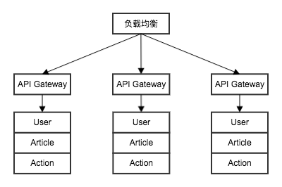

# 类Facebook Like 系统架构设计




### 难点
* 每秒`like`计数器的访问量达到 30w/s, 单机关系数据的QPS 在12w/s 左右?
* 优先显示`like`的好友列表?
* 随着`like`对象数据量的增长，如何保持一个稳定的访问性能?
* 随着数据量的增长，如何扩容?


### 架构设计

整个架构采用微服务架构设计，整个系统分为以下几个微服务：
* `pig` - 公共 ID 生成器(Public ID Generator)
* `feed` - Feed 实体生成关系服务
* `user` - 用户账户服务
* `action` - 用户行为系统，包括了用户`like`行为，用户`follow`行为

各微服务之间使用`RESTful API` 和 `MQ` 实现通信。


#### `pig` 服务

`pig`服务维护了整个架构的实体`TYPE`, 基于`redis` 实现 ID 的自增。`pig` 是一个单机系统，在目前的需求下，是完全能够满足需求的。


#### `feed` 服务

`feed` 服务是一个简单的`feed`实体管理服务, 主要包括的功能有：`feed`的增删改查，`feed`列表获取，`feed`的 操作数据查询(包括`like`计数)。

`feed` 就服务是整个系统性能的瓶颈所在。

###### 数据结构

```go
type Feed struct {
    Id     int64  `json:"id"`
    UserId int64  `json:"user_id"`
    Data   string `json:"data"`

    LikeCount   int64 `json:"like_count"`
    ShareCount  int64 `json:"share_count"`

    CreatedUtc  int64 `json:"created_utc"`
    ModifiedUtc int64 `json:"modified_utc"`
    Deleted     bool  `json:"deleted"`
    DeletedUtc  int64 `json:"deleted_utc"`
}
```


#### `user` 服务

`user` 服务是一个简单的账户系统，实现了简单的账户注册, 登录等功能

###### 数据结构

``` go
type Account struct {
    Id        int64  `json:"id"`
    Name      string `json:"name"`   
    Password  string `json:"password"`
    IsOnline  bool   `json:"is_online"`

    CreatedUtc  int64 `json:"created_utc"`
    ModifiedUtc int64 `json:"modified_utc"`
    Deleted     bool  `json:"deleted"`
    DeletedUtc  int64 `json:"deleted_utc"`
}
```


#### `action` 服务

将用户的所有行为抽象一个动作，这些动作都由`action`这个服务来负责管理和提供查询功能，动作包括`like`, `follow`等。(如果是一个线上项目，可能每个动作一个微服务的设计更好些)。

`action` 主要难点在于数据库的动态扩容。

###### 数据结构

``` go
type LikeAction struct {
    Id          int64    `json:"id"`
    UserId      int64    `json:"user_id"`
    Target      int64    `json:"target"`
    Mood        LikeMood `json:"mood"`
    CreatedUtc  int64    `json:"created_utc"`
    ModifiedUtc int64    `json:"modified_utc"`
    Deleted     bool     `json:"deleted"`
    DeletedUtc  int64    `json:"deleted_utc"`
}

type Follow struct {
    Id          int64    `json:"id"`
    UserId      int64    `json:"user_id"`
    Target      int64    `json:"target"`
    CreatedUtc  int64    `json:"created_utc"`
    ModifiedUtc int64    `json:"modified_utc"`
    Deleted     bool     `json:"deleted"`
    DeletedUtc  int64    `json:"deleted_utc"`
}
```
